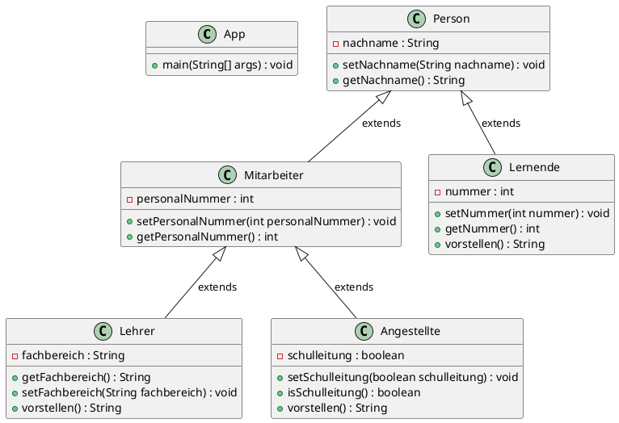

### Aufgabenstellung

Neu sollen auch die Mitarbeiter des BZT erfasst werden. Wie die Lehrer sind sie beim Kanton angestellt und müssen daher mit ihrer Personalnummer erfasst werden.

Folgendes UML-Diagramm zeigt die Zielsituation:



Folgende Ausgabe sollten Sie produzieren können:

```
Ich heisse Muster
Ich heisse Moritz. Meine Nummer ist 4711
Guten Tag, ich heisse Lempel. Ich lehre RitschRatschMühle und meine Personalnummer ist 12345
Guten Tag, ich heisse Verwalti. Meine Personalnummer ist 54321 und ich bin Schulleitungsmitglied.
```

### Lösung 

> Klasse Person

```java
public class Person {
    private String nachname = new String();

    public void setNachname(String nachname)
    {
        this.nachname = nachname;
    }

    public String getNachname()
    {
        return nachname;
    }

}
```

> Klasse Lernende

```java
public class Lernende extends Person {

    private int nummer;  // Schülernummer

    public void setNummer(int nummer)
    {
        this.nummer = nummer;
    }

    public int getNummer()
    {
        return nummer;
    }  

    public String vorstellen() {
        String vorstellung = "Ich heisse " + getNachname()
                            + ". Meine Nummer ist " + getNummer();
        return vorstellung; 
    }
}
```

> Klasse Mitarbeiter

```java
public class Mitarbeiter extends Person {
    int personalnummer;

    public int getPersonalnummer() {
        return personalnummer;
    }

    public void setPersonalnummer(int personalnummer) {
        this.personalnummer = personalnummer;
    }
}
```

> Klasse Lehrer

```java
public class Lehrer extends Mitarbeiter {
    private String fachbereich = new String(); // ein String ist eine Klasse, 
                                            // das geht deshalb mit new!
    public void setFachbereich(String fachbereich)
    {
        this.fachbereich = fachbereich;
    }

    public String getFachbereich()
    {
        return fachbereich;
    }

    public String vorstellen() {
        String vorstellung = "Guten Tag, ich heisse " + getNachname()
                            + ". Ich lehre " + getFachbereich() 
                            + " und meine Personalnummer ist " + getPersonalnummer();
        return vorstellung; 
    }
}
```

> Klasse Angestellte

```java
public class Angestellte extends Mitarbeiter {
    private boolean schulleitung;

    public boolean isSchulleitung() {
        return schulleitung;
    }

    public void setSchulleitung(boolean schulleitung) {
        this.schulleitung = schulleitung;
    }

    public String vorstellen() {
        String vorstellung = "Guten Tag, ich heisse " + getNachname()
                            + ". Mein Personalnummer ist " + getPersonalnummer();
        if(isSchulleitung()) {
            vorstellung += " und ich bin Schulleitungsmitglied.";
        }
        
        return vorstellung; 
    }
}
```

> Klasse App

```java
public class App
{
    public static void main(String[] args)
    {
        Person p1 = new Person();
        p1.setNachname("Muster");

        Lernende lernende1 = new Lernende();
        lernende1.setNachname("Moritz");
        lernende1.setNummer(4711);
        
        Lehrer lehrer1 = new Lehrer();
        lehrer1.setNachname("Lempel");
        lehrer1.setFachbereich("RitschRatschMühle");
        lehrer1.setPersonalnummer(12345);

        Angestellte a1 = new Angestellte();
        a1.setNachname("Verwalti");
        a1.setPersonalnummer(54321);
        a1.setSchulleitung(true);

        System.out.println("Ich heisse " + p1.getNachname());
        System.out.println(lernende1.vorstellen());
        System.out.println(lehrer1.vorstellen());
        System.out.println(a1.vorstellen());
    }
}
```