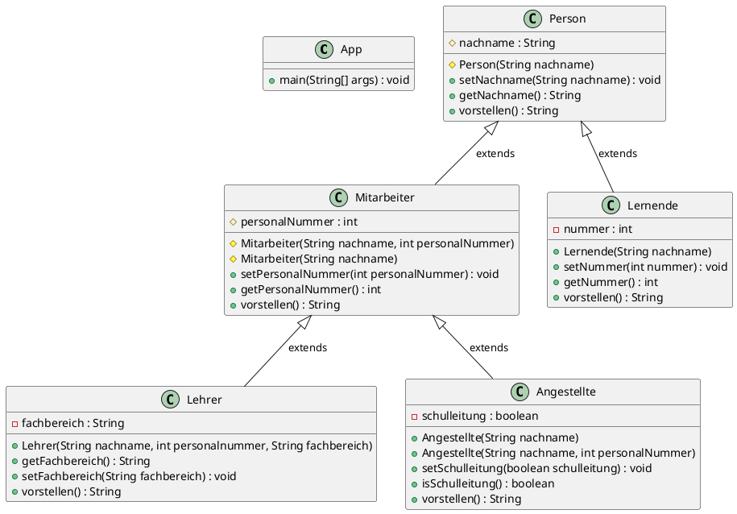

### Aufgabenstellung

Ändern Sie die Klasse Person und Lernende gemäss dem UML- Klassendiagramm ab.



Ihr Projekt sollte jetzt folgende Ausgabe produzieren können:

```
Guten Tag, ich heisse Warner Brother! Von der class BZT4.Person. 
Guten Tag, ich heisse Lempel Zip! Von der class BZT4.Lehrer. Ich lehre Informatik und meine Personalnummer ist 0
Guten Tag, ich heisse Heini Lern! Von der class BZT4.Lernende. Meine LernendeNr ist 7890
Guten Tag, ich heisse Hans Schläffrig! Von der class BZT4.Angestellte. Meine Personalnummer ist 345 und ich bin einfacher Angestellter 
Guten Tag, ich heisse Anna Schaffig! Von der class BZT4.Angestellte. Meine Personalnummer ist 0 und ich bin Schulleitungsmitglied 
```

### Lösung

> Klasse Person

```java
public class Person {
    protected String nachname = new String();

    protected Person(String nachname)
    {
        this.nachname = nachname;
    }

    public void setNachname(String nachname)
    {
        this.nachname = nachname;
    }

    public String getNachname()
    {
        return nachname;
    }

    public String vorstellen() {
        String vorstellung = "Guten Tag, ich heisse " + getNachname() + "Von der class" + this.getClass();
        return vorstellung;
    }
}
```

> Klasse Lernende

```java
public class Lernende extends Person {

    private int nummer;  

    public Lernende(String nachname) {
        super(nachname);
    }

    public void setNummer(int nummer)
    {
        this.nummer = nummer;
    }

    public int getNummer()
    {
        return nummer;
    }  

    public String vorstellen() {
        String vorstellung = "Guten Tag, ich heisse " + getNachname() + "! Von der class " + this.getClass() + ". Meine LernendeNr ist " + getNummer();
        return vorstellung; 
    }
}
```

> Klasse Mitarbeiter

```java
public class Mitarbeiter extends Person {
    protected int personalnummer;

    protected Mitarbeiter(String nachname) {
        this(nachname, 0);
    }

    protected Mitarbeiter(String nachname, int personalnummer) {
        super(nachname);
        this.personalnummer = personalnummer;
    }

    public int getPersonalnummer() {
        return personalnummer;
    }

    public void setPersonalnummer(int personalnummer) {
        this.personalnummer = personalnummer;
    }

    public String vorstellen() {
        String vorstellung = "Guten Tag ichm heisse " + getNachname() + "! Von der class " + this.getClass();
        return vorstellung;
    }
}
```

> Klasse Lehrer

```java
public class Lehrer extends Mitarbeiter {
    private String fachbereich = new String(); 

    public Lehrer(String nachname, int personalnummer, String fachbereich) {
        super(nachname, personalnummer);
        this.fachbereich = fachbereich;
    }
                           
    public void setFachbereich(String fachbereich)
    {
        this.fachbereich = fachbereich;
    }

    public String getFachbereich()
    {
        return fachbereich;
    }

    public String vorstellen() {
        String vorstellung = "Guten Tag, ich heisse " + getNachname() + "! von der class " + this.getClass() 
                            + ". Ich lehre " + getFachbereich() + " und meine Personalnummer ist " + getPersonalnummer();
        return vorstellung; 
    }
}
```

> Klasse Angestellte

```java
public class Angestellte extends Mitarbeiter {
    private boolean schulleitung;

    public Angestellte(String nachname) {
        super(nachname);
    }

    public Angestellte(String nachname, int personalnummer, boolean schulleitung) {
        super(nachname, personalnummer);
        this.schulleitung = schulleitung;
    }

    public boolean isSchulleitung() {
        return schulleitung;
    }

    public void setSchulleitung(boolean schulleitung) {
        this.schulleitung = schulleitung;
    }

    public String vorstellen() {
        String vorstellung = "Guten Tag, ich heisse " + getNachname() + "! Von der class " + this.getClass() 
                            + ". Mein Personalnummer ist " + getPersonalnummer();
        if(isSchulleitung()) {
            vorstellung += " und ich bin Schulleitungsmitglied.";
        } else {
            vorstellung += " und ich bin einfacher Angestellter";
        }
        
        return vorstellung; 
    }
}
```

> Klasse App

```java
public class App
{
    public static void main(String[] args)
    {
        Person p1 = new Person("Warner Brother");
        Lehrer lehrer1 = new Lehrer("Lempel Zip", 0, "Informatik");
        Lernende lernende1 = new Lernende("Heinri Lern");
        lernende1.setNummer(7890);
        Angestellte a1 = new Angestellte("Hans Schläffrig", 345, false);
        Angestellte a2 = new Angestellte("Anna Schaffig", 0, true);

        System.out.println(p1.vorstellen());
        System.out.println(lehrer1.vorstellen());
        System.out.println(lernende1.vorstellen());
        System.out.println(a1.vorstellen());
        System.out.println(a2.vorstellen());
    }
}
```